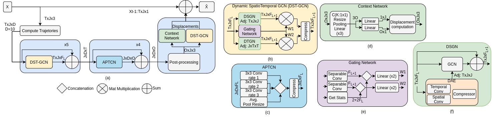

# CIST-GCN: Interpretable Human Motion Prediction

Official PyTorch Implementation of the paper: **Context-based Interpretable Spatio-Temporal Graph Convolutional Network for Human Motion Forecasting** accepted in **WACV2024**

[[Proceedings](https://openaccess.thecvf.com/content/WACV2024/papers/Medina_Context-Based_Interpretable_Spatio-Temporal_Graph_Convolutional_Network_for_Human_Motion_Forecasting_WACV_2024_paper.pdf)] [[Arxiv](https://arxiv.org/abs/2402.19237)]



## Installation

To setup the environment:

```
cd cistgcn
conda create -n cistgcn python=3.10
conda activate cistgcn
pip install -r requirements.txt
```

We also provide a DOCKERFILE.

## Data

Due to licensing it is not possible to provide any data. Please refer to [STSGCN](https://github.com/FraLuca/STSGCN) for the preparation of the dataset files. 

for the preparation of the dataset files. We have some adapted codes in our repository.

We reference all (or at least as much as possible) the codes. Please, we kindly refer the reader to the various references.

## Python functions

Mainly there are 4 python files to run independently.
Although the organization is quite flexible and powerful, the main disadvantage is that yaml files must be saved in
some place to avoid lose the experiment conditions (however, train.py makes it automatically). evaluate, data-analysis
and predict need the binary model and data paths. Nevertheless, data-analysis may require data paths only.

The files are:

```
bin/train.py  # For training
bin/evaluate.py  # Perform a more sophisticated evaluation table
bin/predict.py  # Predict motion on a set of input indexes. Also useful for interpretability
bin/data-analysis.py # [ongoing] A module to analyze the dataset and model outputs in a modular way like a tool.
```

## How to run

All main files depend on a yaml file configuration. Check all of them independently to obtain detailed functionalities.

all hyperparameters are configured inside a YAML file located as the first argument of the main 4 python files. This
file might be obtained from the folder "config", organized as following:

```
.
- config
├── architecture1
├── architecture2
├── CISTGCN
├────  local.yaml
├────  eval-0.yaml
├────  eval-1.yaml # Custom your own testing (of course changing data or external processes, because model was already trained).
├────  custom-file-to-run.yaml # N training might require N YAML files.
├── architecture3 
```

Every folder here are architectures that were tested and also benchmarked. "CISTGCN" is the folder that has the
interpretable results.

NOTE: Paths are difference in remote and local yaml files. This is the main difference between both.

### Setup

To run evaluation and a single sample prediction. we need to first download the dataset and set it `repository-folder/data/{dataset}` and download the model files (tar format) from this link [download CISTGCN models](https://huggingface.co/QualityMinds/CISTGCN/tree/main), save them in `repository-folder/ckpts/{archtecture-configuration}`.
the parameter `architecture-configuration` is described in the paper and set to 8, 16, 32, or 64.

### Evaluation

To evaluate the model using specific a specific subset and optionally extract detailed Excel sheets file is possible just
running the command at the end of the section for local testing:

NOTE: There are two ways to compute the evaluation. "metrics", which obtains global numbers from the current subset you
want to obtain the numbers, and "samples" which obtains specifically the metric for every sample available in the
subset. It is important to mention that "samples" configuration delays 10-30 times more than "metrics" (depending on the
dataset size) given that computing sample losses and file saving is computationally more expensive.

NOTE 2: available test configurations depends on the dataset you want to use. names are basically: "train", "test", "
full_original_test", "original_test".

```
python -m human_motion_prediction.evaluate "config/CISTGCN/local_eval.yaml"
```

The most important part is located on evaluation_config:

```
evaluation_config:
  outputs_path: "" # if empty uses the model path as default (replacing everything inside) 
  sets: # available sets from the dataset, for instance, H3.6M have train, test, original_test, and full_original_test.
    original_test:
      classes: # here "all" takes every available class or just mention the list of the preferred classes.
        - "all"
      evaluate: # there are mainly two types of computation to generate excel files
        - metrics # Get global metrics using different error metrics in temporal and spatial domains.
        - samples # Get specific results on every sample using the "metrics" option. This is much harder computation
      visualization:
        action_batch_samples: 2 # plot number of 2 samples per action batch. HINT: every figure could take a time.
        repeat: 2 # number of times that the figure will be repeated. Using more rotation in the first (or single) view.
        mode: # "single" or "multi" to have 1 or 4 views.
        plot_joints: true # plot joint number of figure

```

### Predict

If we want to run a model on a singular sample or few samples, we use the following command to set which subsets and
indexes we want to process. Optionally, we are able to obtain the interpretability results from the CISTGCN model. Still
not validated if this would work on models that do not have interpretation outputs, however it could be out of the focus
of the repository and project.

```
python -m human_motion_prediction.predict "config/CISTGCN/local_eval.yaml" --online-plot
```

This code will provide visualizations and values of every sample (including interpretation outputs). saved on "
outputs_path" or using the relative path from the model by default.

The most important part is located on evaluation_config:

```
evaluation_config:
  outputs_path: "" # if empty uses the model path as default (replacing everything inside) 
  sets: # available sets from the dataset, for instance, H3.6M have train, test, original_test, and full_original_test.
    original_test:
      classes:
        - "walking"
      index: # indexes to process inside the class above.
        - 13
        - 189
      visualization:
        repeat: 2 # number of times that the figure will be repeated. Using more rotation in the first (or single) view.
        mode: # "single" or "multi" to have 1 or 4 views.
        plot_joints: true # plot joint number of figure

```


### Train

To train a model, just run the following command using the preferred configuration. Please, note that remote-x.yaml are
already configured for this situation. Hyperparameter modification is a research topic and everything here is completely
customized up to the topology that is used.

```
python -m human_motion_prediction.train "config/CISTGCN/local.yaml"
```


### Robustness test

The evaluate_robustness.py script is used to automatically generate evaluation results (.xlsx Excel files) in the
eval_results folder. Before you run the script you need to save the trained models in the ```files``` directory. The
script need to be run with a ```robustness-test-${MODEL_NAME}.yaml``` config file. Change the ```model_file_path``` in
the config file, if the trained model is stored in another path. The ```evaluation_config``` contains all the robustness
test to be performed for the evaluation.

The explanation of the config file is provided as below:

```
general_config:
  model_name: # name of the model
  model_file_path: # path to the trained model weights
  evaluation_path: # path to the evaluation script
  robustness_test_config_path: # path to the robustness test config file
evaluation_config:
  - name: # robustness test type
    x: # range of values generated using numpy.linspace(), the list is formulated as `[start, end, step size]
    y:
    z:
    continuous: # boolean, whether to have a smooth interpolation for the applied sequence 
    keep: # boolean, whether to keep the last applied transformation for the succeeding frames
    seq_idx: # list, formatted as [start of the sequence, end of the sequence], e.g. [3, 7] applied advasarial attacks on the 3-7 frames
template_config: # template of the robustness test to be copy to the 'robustness_test_config_path' config file, the template variables are changed during runtime and paste to the 'robustness_test_config_path' config file, so the automatically changing of the 'robustness_test_config_path' config file is performed.
```

This is how you run the ```evaluate_robustness.py``` script:

```
python -m human_motion_prediction.evaluate_robustness "config/robustness-test-${MODEL_NAME}.yaml"
```

After generating all the evaluation results, you can run the ```visualization_results.py``` script to generate plots of
the results. The config file ```robustness-test-visualization.yaml``` is formulated as below:

```
visualization_config:
  model_names: # list of all the models to be evaluated, e.g. CISTGCN, STS-GCN etc.
  robustness_test_folder_path: # list of all the folder to find the robustness test results of their corresponding models
  robustness_test: # robustness test to be performed, e.g. rotationx, scaley, translationz, noise, etc
  mode: # average_error: generate plots where x-axis is the robustness_test_value and y-axis mpjpe, frame_wise_error: generate plots where x-axis is the frames (0-1000ms) and y-axis mpjpe
  robustness_test_value: # average_error # linspace: [start, end, step_size]
  conditions: # conditions for the robustness test, e.g. keep, continuous and sequence. the conditions are stored in a string, "cont_keep_seq_3_7" is for example how you write it. The string is then used to search for the file names.
```

To run the scripts:

```
python -m human_motion_prediction.visualization_results "config/robustness-test-visualization.yaml"
```


### Data analysis

In contrast to other YAML files, model is not required here to run the data analysis, so customization here is up to the
person that is programming in this branch. Still this is an ongoing work.

```
python -m human_motion_prediction.data-analysis "config/data-analysis.yaml"
```

the behavior of this function has not yet been validated and may contain errors.

## TODO:

MAE metric must be converted from 3D joint to angle and compare make a comparison from there. 
- --------------------------

- [ ] Solve the issue on MAE metric (BUG)
- [ ] Augmentations: noise in temporal domain.
